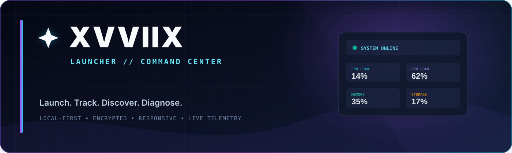

<div align="center">



<br>

[](https://www.python.org/downloads/)
[](#requirements)
[](#interface)
[](#privacy-and-security)

### A fast, cinematic command center for games, applications, diagnostics, and live hardware telemetry.

**Launch. Track. Discover. Diagnose.**  
No account, analytics, cloud library, or always-running telemetry service.

[Features](#features) · [Install](#quick-start) · [Monitor](#hardware-monitor) · [Security](#privacy-and-security) · [Troubleshooting](#troubleshooting)

</div>

---

## Overview

**XVVIIX Launcher** combines a polished game library with application shortcuts, intelligent local discovery, encrypted reports, crash analysis, and an on-demand Hardware Monitor—all inside one responsive desktop interface.

The project is designed around three principles:

- **Fast first paint** — expensive integrations load only when requested.
- **Local ownership** — library data, activity, and reports remain on your machine.
- **Graceful degradation** — missing optional packages or unsupported hardware never prevent the launcher from opening.

> **Current status:** feature-complete for the published roadmap. The canonical application is `game_launcher.py`; the Hardware Monitor is integrated directly into that file and is not a separate program.

---

## Features

<table>
<tr>
<td width="50%" valign="top">

### 🎮 Unified launcher

- Separate **Games**, **Workspace**, and **Discovered** libraries
- Pinning, sorting, search, playtime tracking, and task termination
- `.exe`, `.bat`, and Windows shortcut support
- Custom icons and responsive artwork cards
- Optional trainer launch flow for games
- Safe location repair for moved or renamed executables

</td>
<td width="50%" valign="top">

### ✦ Intelligent discovery

- Reads Windows Start Menu and uninstall metadata locally
- Classifies games, applications, drivers, installers, and system tools
- Filters scanner noise instead of polluting the review queue
- Recovers likely renamed launchers conservatively
- Keeps ambiguous results available for manual review

</td>
</tr>
<tr>
<td width="50%" valign="top">

### △ Reports and diagnostics

- Full local **SYS REPORT** pipeline
- Hardware, OS, storage, network, power, and security sections
- Deterministic Windows crash-code analysis
- Actionable findings and health scoring
- Searchable encrypted report archive
- Copy and deletion controls

</td>
<td width="50%" valign="top">

### ⌁ Live Hardware Monitor

- CPU, GPU, memory, storage, network, battery, and thermal telemetry
- Normalized `0–100%` process CPU values
- Exact current-user process inventory
- Process search and CPU/RAM/name/PID sorting
- Draggable always-on-top compact overlay
- NVIDIA NVML and Windows PDH GPU backends

</td>
</tr>
</table>

---

## Performance by design

XVVIIX does not keep its heaviest systems running when they are not needed.

| Optimization | Behavior |
|---|---|
| **On-demand telemetry** | Hardware Monitor remains in zero-overhead standby until the Monitor tab or overlay is opened. |
| **Deferred GPU backend** | NVML/PDH initialization happens outside the Tk interface thread. |
| **Deferred audio** | The optional audio backend imports after first paint in a background worker. |
| **Process sampling cache** | Expensive current-user process enumeration runs once every 2 seconds. |
| **Balanced UI refresh** | Dashboard and overlay refresh at an efficient 900 ms cadence. |
| **Automatic idle stop** | Telemetry stops after leaving Monitor when no overlay is open. |
| **Responsive queue** | Worker results are applied on the Tk thread within a bounded time budget. |
| **Short intro** | The safe Tk splash is limited to 350 ms. |

The monitor owns no independent application window or event loop. It is a launcher-managed service with explicit startup, failure, idle, and shutdown states.

---

## Interface

### Library command center

The primary view adapts from compact laptop widths to larger desktop layouts. Cards expose launch, trainer, location, icon, pin, and end-task actions without hiding core controls in menus.

### Hardware Monitor

Open **MONITOR** from the main navigation. XVVIIX activates telemetry asynchronously and displays:

- Overall and per-core CPU load, frequency, and available temperatures
- NVIDIA GPU utilization, VRAM, clock, power, fan, and temperature where supported
- Memory, swap, system-volume usage, and disk throughput
- Upload/download rates, active interfaces, local IPv4 addresses, and TCP latency
- Host identity, uptime, process/thread counts, battery, and sensor data
- Current-user processes with normalized CPU and bounded memory percentages

Press <kbd>Ctrl</kbd> + <kbd>Alt</kbd> + <kbd>M</kbd> to open or compact the overlay. Press <kbd>F11</kbd> to toggle fullscreen.

> GPU details depend on the installed driver and backend. Unsupported hardware displays `N/A` instead of blocking startup.

---

## Privacy and security

XVVIIX is local-first by default.

- **AES-256-GCM** authenticated encryption for protected JSON data
- **scrypt** password derivation for the local master password
- Atomic writes, authenticated decryption, and recovery backups
- No analytics, advertising SDK, account requirement, or cloud synchronization
- Scanner and diagnostics execute locally
- Passwords are not stored by the launcher

The Monitor performs one optional TCP latency check against `1.1.1.1:443`; it sends no library or diagnostic content. Remove or change the probe target in `game_launcher.py` if your environment prohibits outbound checks.

> Keep your vault password safe. It cannot be recovered by the project maintainers.

---

## Quick start

### Requirements

- **Windows 10 or Windows 11** recommended
- **Python 3.11+** recommended
- Tk/Tcl enabled in the Python installer
- A supported NVIDIA driver for full NVML telemetry (optional)

Linux can be used for development and UI validation, but Windows-only integrations—registry discovery, DWM effects, PDH GPU counters, COM shortcuts, and native executable metadata—degrade gracefully when unavailable.

### 1. Clone

```powershell
git clone https://github.com/xvviix/XVVIIX-Launcher.git
cd XVVIIX-Launcher
```

### 2. Create an environment

```powershell
py -3 -m venv .venv
.\.venv\Scripts\Activate.ps1
python -m pip install --upgrade pip
pip install -r requirements.txt
```

### 3. Launch

Double-click:

```text
START_XVVIIX.bat
```

Or run directly:

```powershell
python game_launcher.py
```

On first launch, XVVIIX asks you to create a master password and initializes its encrypted local data files.

---

## Optional audio assets

Third-party audio binaries are intentionally **not redistributed in this public source repository**. The application remains fully usable without them and reports audio as unavailable rather than failing.

If you have appropriate licenses, place audio files at the paths referenced by `SOUNDS` and `MUSIC_FILE` in `game_launcher.py`. See [`MUSIC_CREDITS.txt`](MUSIC_CREDITS.txt) for the original music attribution and usage notes.

---

## Project structure

```text
XVVIIX-Launcher/
├── game_launcher.py          # Complete application and integrated Monitor service
├── START_XVVIIX.bat          # Diagnostic Windows launcher
├── requirements.txt          # Python dependencies
├── List-Features.txt         # Completed roadmap state
├── MUSIC_CREDITS.txt         # Optional music attribution and license summary
├── icon.ico                  # Application icon
├── assets/
│   └── xvviix_header.png     # Header artwork
└── docs/images/
    └── xvviix-banner.svg     # GitHub README artwork
```

Runtime libraries, encrypted vault metadata, settings, logs, icon caches, backups, and licensed audio are excluded from version control.

---

## Configuration and data

When the source directory is writable, XVVIIX stores runtime data beside the launcher. In a protected installation, it falls back to:

```text
%LOCALAPPDATA%\XVVIIXLauncher
```

Common generated files include:

| File | Purpose |
|---|---|
| `xvviix_vault.json` | Vault metadata and password verifier |
| `games.json` | Encrypted game library |
| `apps.json` | Encrypted workspace library |
| `founded.json` | Encrypted discovery review queue |
| `reports.json` | Encrypted diagnostic and crash reports |
| `activity.json` | Encrypted recent activity |
| `launcher_settings.json` | Small validated UI/audio preferences |
| `xvviix_launcher.log` | Structured startup and runtime diagnostics |

Do not commit these generated files.

---

## Troubleshooting

<details>
<summary><strong>The window does not open</strong></summary>

1. Run `START_XVVIIX.bat` instead of double-clicking the Python file.
2. Read `xvviix_launcher.log` in the project or `%LOCALAPPDATA%\XVVIIXLauncher`.
3. Confirm Tk/Tcl was enabled in the official Python installer.
4. Run `pip install -r requirements.txt` inside the active virtual environment.

</details>

<details>
<summary><strong>GPU telemetry shows N/A</strong></summary>

- Update the graphics driver.
- Install `nvidia-ml-py` from `requirements.txt` for NVIDIA telemetry.
- On Windows, XVVIIX falls back to PDH GPU engine counters when NVML is unavailable.
- Virtual machines and some integrated adapters may not expose detailed counters.

</details>

<details>
<summary><strong>Drag and drop is unavailable</strong></summary>

Install `tkinterdnd2`, restart XVVIIX, and verify that the package was installed into the same Python environment used by `START_XVVIIX.bat`.

</details>

<details>
<summary><strong>Audio is unavailable</strong></summary>

Install `pygame` and provide locally licensed audio assets at the paths configured in `game_launcher.py`. Audio failure is non-fatal by design.

</details>

<details>
<summary><strong>The vault cannot be unlocked</strong></summary>

Verify that the matching `xvviix_vault.json` or backup is present. Do not replace vault metadata independently of the encrypted data files. The master password cannot be reset without decrypting the original data.

</details>

---

## Development checks

```powershell
python -m py_compile game_launcher.py
python -m pyflakes game_launcher.py
```

The project has also been exercised with virtual-display UI tests covering compact layouts, repeated tab switching, on-demand Monitor startup, process filtering/sorting, overlay lifecycle, percentage constraints, degraded startup, and clean service shutdown.

---

## Contributing

Issues and focused pull requests are welcome.

1. Keep the launcher as the primary application shell.
2. Keep optional integrations non-fatal.
3. Do not perform blocking I/O on the Tk interface thread.
4. Preserve bounded data structures and percentage constraints.
5. Do not commit user data, credentials, logs, caches, or unlicensed media.
6. Run compile and lint checks before opening a pull request.

---

## Credits

- **Galactic Odyssey** — AlkaKrab, from *Free Sci-Fi Music Pack Vol. 2* (optional local asset; see [`MUSIC_CREDITS.txt`](MUSIC_CREDITS.txt))
- Built with Python, Tkinter, Pillow, psutil, cryptography, and optional platform integrations

<div align="center">

<br>

**XVVIIX** · Local-first launch systems

[Report a bug](https://github.com/xvviix/XVVIIX-Launcher/issues) · [Request a feature](https://github.com/xvviix/XVVIIX-Launcher/issues)

</div>
