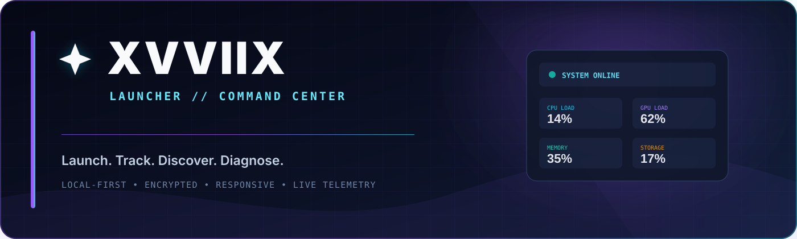

<div align="center">



<br>

[](https://www.python.org/downloads/)
[](#requirements)
[](#interface)
[](#privacy-and-security)

### A fast, cinematic command center for games, applications, diagnostics, and live hardware telemetry.

**Launch. Track. Discover. Diagnose.**  
No account, analytics, cloud library, or always-running telemetry service.

[Features](#features) · [Install](#quick-start) · [Monitor](#hardware-monitor) · [Security](#privacy-and-security) · [Troubleshooting](#troubleshooting)

</div>

---

## Overview

**XVVIIX Launcher** combines a polished game library with application shortcuts, intelligent local discovery, encrypted system diagnostics and an on-demand Hardware Monitor—all inside one responsive desktop interface.

The current version also adds a transparent top-five Monitor and removes automatic crash reporting. See [monitor changes](docs/monitor-update.md). Stability changes cover non-destructive handling of damaged backups, Windows virtual-environment startup, pinned dependencies, and Linux/Windows CI. See [stability and upgrade notes](docs/stability.md).

The project is designed around three principles:

- **Fast first paint** — expensive integrations load only when requested.
- **Local ownership** — library data, activity, and reports remain on your machine.
- **Graceful degradation** — missing optional packages or unsupported hardware never prevent the launcher from opening.

> **Current structure:** `game_launcher.py` is the desktop entry point; the application is organized in the `xvviix/` package. Vault storage, cryptography, record models, audio, telemetry and password dialogs have separate owners. The Monitor is still integrated into the same launcher, not a separate program. See [architecture and upgrade notes](docs/architecture.md).

---

## Features

<table>
<tr>
<td width="50%" valign="top">

### 🎮 Unified launcher

- Separate **Games**, **Workspace**, and **Discovered** libraries
- Stable per-card updates, scroll anchoring, top/bottom pagination and multi-selection
- Group move/remove/pin actions, sorting, search, playtime tracking and verified End Task
- Background `.exe`/`.bat` launch and Windows shortcut discovery
- Current-user Windows startup with a persistent in-app off switch
- Native multi-resolution ICO caches, custom icons and responsive artwork cards
- Non-blocking trainer/game startup with pending-launch feedback
- Exit warning and final timing checkpoint without waiting for or closing games

</td>
<td width="50%" valign="top">

### ✦ Intelligent discovery

- Exactly two modes: Control Panel apps or usual installation locations
- Local evidence-based rules using version resources, library paths and engine files
- Runtime/helper filtering, main-executable deduplication and no whole-drive sweep
- Strong identity matching for renamed launchers; uncertain cases stay for review
- Keeps ambiguous results available for manual review

</td>
</tr>
<tr>
<td width="50%" valign="top">

### △ Reports and diagnostics

- Full local **SYS REPORT** pipeline
- Hardware, OS, storage, network, power, and security sections
- Actionable findings and health scoring
- Encrypted system-diagnostic archive
- Copy and deletion controls

</td>
<td width="50%" valign="top">

### ⌁ Live Hardware Monitor

- CPU, GPU, memory, storage, network, battery, and thermal telemetry
- Normalized `0–100%` process CPU values
- Top five CPU and top five RAM processes for the current user
- Bounded leaderboards without executable-path/thread/state queries
- Reference-style draggable overlay with a 60 Hz animation target
- NVIDIA NVML and Windows PDH GPU backends

</td>
</tr>
</table>

---

## Performance by design

XVVIIX does not keep its heaviest systems running when they are not needed.

| Optimization | Behavior |
|---|---|
| **On-demand telemetry** | Hardware Monitor remains in zero-overhead standby until the Monitor tab or overlay is opened. |
| **Deferred GPU backend** | NVML/PDH initialization happens outside the Tk interface thread. |
| **Deferred audio** | The optional audio backend imports after first paint in a background worker. |
| **Top-five sampling** | A lightweight current-user pass every 3 seconds selects five CPU and five RAM leaders; only at most ten records are retained. |
| **Independent render/sample clocks** | The overlay targets 60 Hz animation; it reads a small cached summary at 2 Hz while sensors sample about 1 Hz. The main tab retains 900 ms polling. |
| **Visible work only** | Hidden/compact overlays stop animating; telemetry stops after neither Monitor view is visible. |
| **Responsive queue and artwork** | A 4 ms UI result budget, lazy bounded background artwork preparation, and per-card updates avoid synchronous image stalls. |
| **Short intro** | The safe Tk splash is limited to 350 ms. |

The telemetry service owns no UI or separate event loop. Its new floating panel is a launcher-owned Tk window with explicit visibility, animation and timer lifetimes. See [performance measurements and limits](docs/performance.md).

---

## Start with Windows

On Windows, XVVIIX registers **current-user login startup** after its first successful launch/unlock. Open **Settings → Start with Windows** to turn it off or back on. The opt-out is remembered; the launcher does not silently recreate a disabled entry. No administrator access is required, and the vault password is still required at startup.

Keep the project in a permanent folder. Windows Startup Apps controls can independently disable the registration. See [startup settings, registry paths and troubleshooting](docs/windows-startup.md).

## Launch, scan and exit updates

Process creation, trainer startup and administrator dispatch run off the Tk event thread. When closing with running programs, XVVIIX warns that timing will stop, saves a checkpoint and leaves those programs open. Slow final saves have a responsive retry/explicit-exit dialog.

Scanning now offers only **Control Panel — registered apps** and **Find programs — usual install locations**. Whole-system/drive scanning is removed. Runtime components such as .NET and embedded 7-Zip helpers are filtered, and duplicate product versions prefer the main executable. See [current library workflow](docs/library-workflow.md).

## Interface

### Library command center

The primary view adapts from compact laptop widths to larger desktop layouts. Cards expose launch, trainer, location, icon, pin, and end-task actions. Live time/status changes update existing card widgets; structural changes rebuild only the affected card while preserving the scroll anchor. Previous/Next controls are available above and below the cards.

Use checkboxes, Ctrl-click or Shift-click to select entries, then move, pin/unpin or remove them together. Removal affects launcher entries, not program files. **Recent Activity / Open History** opens a searchable, filterable timeline without resetting the card view.

### Hardware Monitor

Open **MONITOR** from the main navigation. XVVIIX activates telemetry asynchronously and displays:

- Overall and per-core CPU load, frequency, and available temperatures
- NVIDIA GPU utilization, VRAM, clock, power, fan, and temperature where supported
- Memory, swap, system-volume usage, and disk throughput
- Upload/download rates, active interfaces, local IPv4 addresses, and TCP latency
- Host identity, uptime, process/thread counts, battery, and sensor data
- Five current-user CPU leaders and five RAM leaders, with normalized percentages

With the launcher focused, press <kbd>Ctrl</kbd> + <kbd>Alt</kbd> + <kbd>M</kbd> to open or compact the overlay. Drag its title to move it; use the square button to collapse/expand, and **×** or **Escape** to close. Press <kbd>F11</kbd> to toggle launcher fullscreen.

The overlay follows the compact reference layout with **80% default opacity**. Right-click it to adjust opacity; collapsed mode retains internet rates. The main Monitor now uses two top-five panels instead of a full process table. The **60 Hz target describes UI drawing, not game FPS or sensor scans**. Borderless/windowed games are the intended use; exclusive-fullscreen overlays are not injected. [Current changes and preview](docs/monitor-update.md).

> GPU details depend on the installed driver and backend. Unsupported hardware displays `N/A` instead of blocking startup.

---

## Privacy and security

XVVIIX is local-first by default.

- **AES-256-GCM** authenticated encryption for protected JSON data
- **scrypt** password derivation for the local master password
- Atomic writes, authenticated decryption, and recovery backups
- No analytics, advertising SDK, account requirement, or cloud synchronization
- Scanner and diagnostics execute locally
- Passwords are not stored by the launcher
- Optional **Forgot Password** flow: code-free local reset that preserves your libraries

The Monitor performs one optional TCP latency check against `1.1.1.1:443`; it sends no library or diagnostic content. Remove or change the probe target in `xvviix/services/hardware_monitor.py` if your environment prohibits outbound checks.

> **Local reset is a convenience lock, not password-only protection.** Anyone using the same OS account with access to the local recovery material can set a new password. Windows protects that material with current-user DPAPI; non-Windows development uses a private `0600` key file. Without an enabled, usable recovery file, a forgotten password cannot be bypassed. See [Password reset](docs/password-reset.md) for setup, legacy-vault limitations and the security model.

---

## Quick start

### Requirements

- **Windows 10 or Windows 11** recommended
- **Python 3.11+** recommended
- Tk/Tcl enabled in the Python installer
- A supported NVIDIA driver for full NVML telemetry (optional)

Linux can be used for development and UI validation, but Windows-only integrations—registry discovery, DWM effects, PDH GPU counters, COM shortcuts, and native executable metadata—degrade gracefully when unavailable.

### 1. Clone

```powershell
git clone https://github.com/xvviix/XVVIIX-Launcher.git
cd XVVIIX-Launcher
```

### 2. Create an environment

```powershell
py -3 -m venv .venv
.\.venv\Scripts\Activate.ps1
python -m pip install --upgrade pip
pip install -r requirements.txt
```

### 3. Launch

Double-click:

```text
START_XVVIIX.bat
```

The BAT file first uses `.venv\Scripts\python.exe` from this project. If it is absent, it falls back to `py -3`, then `python` from PATH. It does not install packages automatically.

**Keep the entire `xvviix/` package beside `game_launcher.py`.** Updating only the entry-point file is not enough. Existing data stays in its previous location; this refactor does not move the vault into the package folder.

Or run directly:

```powershell
python game_launcher.py
```

On first launch, XVVIIX asks you to create a master password and initializes its encrypted local data files. **Enable local password reset on this computer** is checked by default, with a warning explaining who can reset the password; uncheck it for password-only protection.

For an existing vault, the same option starts unchecked and requires one successful sign-in with the current password. Once enabled, choose **FORGOT PASSWORD?**, enter a new password twice, then **SAVE PASSWORD & UNLOCK**. No recovery code, email or old password is needed, and the existing libraries are kept. A legacy vault whose password was already forgotten cannot be recovered retroactively.

---

## Audio assets

XVVIIX includes its cinematic **Galactic Odyssey** background track and four interface sound effects in `assets/`. Music playback is independent from interface cues, volume-controlled, and loaded asynchronously after first paint.

The background track is credited to **AlkaKrab** and comes from *Free Sci-Fi Music Pack Vol. 2*. See [`MUSIC_CREDITS.txt`](MUSIC_CREDITS.txt) for attribution and the supplied license summary. Third-party audio remains subject to its original terms and must not be resold, relicensed, claimed as original work, or redistributed as a standalone audio product.

---

## Project structure

```text
XVVIIX-Launcher/
├── game_launcher.py          # Small desktop entry point
├── START_XVVIIX.bat          # Windows venv/interpreter selection
├── requirements.txt         # Pinned runtime dependencies
├── requirements-dev.txt     # Runtime + static-analysis tooling
├── .github/workflows/       # Linux/Windows regression checks
├── xvviix/
│   ├── app.py               # Desktop composition and legacy library UI
│   ├── paths.py             # Source/frozen paths; existing data location preserved
│   ├── constants.py         # Shared defaults
│   ├── utils.py             # Formatting/path/color helpers
│   ├── models.py            # Record normalization
│   ├── security/crypto.py   # Password derivation, encryption, key wrapping, DPAPI
│   ├── storage/vault.py     # Independent VaultStore state and file integrity
│   ├── services/            # Launching, software catalog, verified termination, icons and telemetry
│   └── ui/                  # Keyed library view, activity history, scan scope, vault and overlay
├── assets/                  # Header artwork, background track and UI cues
├── icon.ico
├── MUSIC_CREDITS.txt
├── tests/                   # Disposable fixtures, backend/UI/Windows regression tests
├── tools/                   # Reproducible synthetic performance benchmark
└── docs/
    ├── architecture.md      # Module boundaries, compatibility and upgrade instructions
    ├── performance.md       # Earlier performance-phase notes
    ├── monitor-update.md    # Opacity, compact network, top five and retired crash reporting
    ├── launch-scan.md       # Earlier responsive launch/exit and icon phase
    ├── library-workflow.md  # Current scanner, per-card updates, bulk actions and activity
    ├── windows-startup.md   # Login startup and the persistent opt-out
    ├── password-reset.md    # Code-free reset and its security model
    ├── stability.md         # Backup/recovery rules and stability-phase notes
    └── images/
```

Runtime libraries, encrypted vault metadata, settings, logs, icon caches, and backups are excluded from version control.

---

## Configuration and data

When the source directory is writable, XVVIIX stores runtime data beside the launcher. In a protected installation, it falls back to:

```text
%LOCALAPPDATA%\XVVIIXLauncher
```

Common generated files include:

| File | Purpose |
|---|---|
| `xvviix_vault.json` | Vault metadata, password verifier and wrapped data key for recoverable vaults |
| `xvviix_local_recovery.json` | Optional secret local recovery material; never publish or share |
| `games.json` | Encrypted game library |
| `apps.json` | Encrypted workspace library |
| `founded.json` | Encrypted discovery review queue |
| `reports.json` | Encrypted system diagnostics; old retired records are retained but hidden |
| `activity.json` | Encrypted recent activity |
| `launcher_settings.json` | Small validated UI/audio/scan preferences |
| `xvviix_launcher.log` | Structured startup and runtime diagnostics |

Do not commit these generated files or any `.corrupt-*` recovery archives. A damaged backup no longer blocks a healthy primary; damaged primary data is never silently replaced with an empty library. Read the [recovery rules](docs/stability.md#recovery-rules) before restoring files.

---

## Troubleshooting

<details>
<summary><strong>The window does not open</strong></summary>

1. Run `START_XVVIIX.bat` instead of double-clicking the Python file.
2. Read `xvviix_launcher.log` in the project or `%LOCALAPPDATA%\XVVIIXLauncher`.
3. Confirm Tk/Tcl was enabled in the official Python installer.
4. Run `pip install -r requirements.txt` inside the active virtual environment.

</details>

<details>
<summary><strong>GPU telemetry shows N/A</strong></summary>

- Update the graphics driver.
- Install `nvidia-ml-py` from `requirements.txt` for NVIDIA telemetry.
- On Windows, XVVIIX falls back to PDH GPU engine counters when NVML is unavailable.
- Virtual machines and some integrated adapters may not expose detailed counters.

</details>

<details>
<summary><strong>Drag and drop is unavailable</strong></summary>

Install `tkinterdnd2`, restart XVVIIX, and verify that the package was installed into the same Python environment used by `START_XVVIIX.bat`.

</details>

<details>
<summary><strong>Audio is unavailable</strong></summary>

Install `pygame` and verify that the bundled `.ogg` and `.wav` files are present in `assets/`. Audio failure is non-fatal by design.

</details>

<details>
<summary><strong>The vault cannot be unlocked</strong></summary>

Verify that the matching `xvviix_vault.json` or backup is present. Do not replace vault metadata independently of the encrypted data files. If local reset was enabled on this computer, use **FORGOT PASSWORD?**. If the recovery file is missing, damaged or tied to another account, sign in with the existing password to enable reset again. Without the password or usable local recovery material, the launcher cannot decrypt the existing data and will not replace it with an empty vault. See [Password reset](docs/password-reset.md).

</details>

---

## Development checks

```powershell
python -m pip install -r requirements-dev.txt
python -m pip check
python -m compileall -q game_launcher.py xvviix tests tools
python -m pyflakes game_launcher.py xvviix tests tools
python -m unittest discover -s tests -v
```

The regression tests use disposable data and cover vault corruption, non-destructive backups, legacy opt-in, password reset, write-failure rollback, package boundaries, old-format ciphertext, service lifecycle and Tk dialogs. DPAPI, native multimedia-timer and real BAT tests run only on Windows; Linux CI supplies a virtual display. The workflow is configured for Linux/Windows with Python 3.11/3.13; it must be pushed to GitHub to run there. See [stability and test instructions](docs/stability.md#automated-checks).

The project has also been exercised with virtual-display UI tests covering compact layouts, repeated tab switching, on-demand Monitor startup, top-five selection, opacity, compact-network display, scan policies, per-card updates, scroll anchoring, multi-selection, verified process exit, activity history and clean service shutdown.

---

## Contributing

Issues and focused pull requests are welcome.

1. Keep the launcher as the primary application shell.
2. Keep optional integrations non-fatal.
3. Do not perform blocking I/O on the Tk interface thread.
4. Preserve bounded data structures and percentage constraints.
5. Do not commit user data, credentials, logs, caches, or unlicensed media.
6. Run compile and lint checks before opening a pull request.

---

## Credits

- **Galactic Odyssey** — AlkaKrab, from *Free Sci-Fi Music Pack Vol. 2* (optional local asset; see [`MUSIC_CREDITS.txt`](MUSIC_CREDITS.txt))
- Built with Python, Tkinter, Pillow, psutil, cryptography, and optional platform integrations

<div align="center">

<br>

**XVVIIX** · Local-first launch systems

[Report a bug](https://github.com/xvviix/XVVIIX-Launcher/issues) · [Request a feature](https://github.com/xvviix/XVVIIX-Launcher/issues)

</div>
