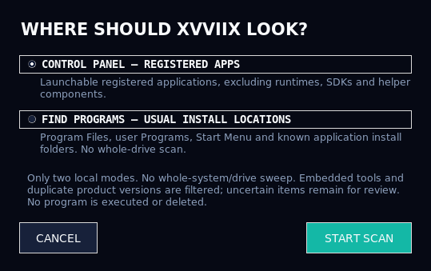

# Responsive launch/exit, scan scopes and native icon quality

> Historical phase notes. The subsequent [library workflow update](library-workflow.md) removes the drive-wide scan modes and replaces them with Control Panel and usual-installation-location discovery. The non-blocking launch/exit and native icon behavior below remain.

## Launching no longer waits on the Tk event thread

Executable validation, process creation, trainer startup and Windows administrator dispatch now run on a bounded set of daemon launch workers. The card shows **STARTING** while the request is in flight, and repeated clicks on the same pending launch are ignored.

The launcher does not wait for the program's window or lifetime before returning control to the interface. A slow disk, antivirus check or UAC prompt may still delay the external program itself, but those operations are not performed by Tk callbacks. Windows elevation uses the normal UAC flow; the launcher does not request or store administrator credentials.

Windows batch paths are passed through a dedicated environment value with delayed expansion disabled, rather than interpolated into command source. Native Windows tests cover spaces and shell metacharacters in filenames.

## Closing while games remain open

When a tracked program is running or a launch is pending, XVVIIX asks for confirmation:

- **The games/programs stay open.** Closing the launcher is not End Task.
- Playtime is checkpointed before exit.
- After exit, timing stops. Reopening later cannot accurately reconstruct the time missed while the launcher was closed.

OS process-liveness queries now run **outside** the model/process locks. The short mutation phase uses a consistent lock order. Shutdown does not poll or wait for active games, and driver/audio cleanup is not joined on the UI thread.

A small responsive closing dialog handles the final save. If saving fails, it offers a retry. If the filesystem stalls, an explicit **Exit without latest save** option becomes available; it warns that recent timing changes may be lost. Existing encrypted files are not deliberately erased. Normal exit waits for the final save, not for games to finish.

Scans and pending background work are cancelled when exit begins. A process already being created by Windows may still open after exit; the warning includes pending launches. No newly spawned game is killed just to let XVVIIX close.

## Select the scan scope

Click the existing scan control and choose:

1. **Quick — registered applications:** Start Menu, installation records and known library locations.
2. **Windows drive:** those local sources, restricted to the Windows drive, plus a recursive executable search there. The drive is detected, not hardcoded to C:.
3. **All local drives:** registered sources plus recursive searches of fixed/removable local drives.

The selected scope is saved as a preference. Disk traversal is read-only and runs on a worker. Progress reports folders, executable candidates, completed drives and skipped/inaccessible locations. Cancellation does not leave an invisible modal grab blocking the main window.

### Scope limits, explicitly

- Network shares/drives, symbolic links/junctions/reparse points and cloud-only/offline files are not followed.
- Windows/recovery/recycle/system-volume folders at drive roots and common development/cache directories are skipped.
- Access-denied locations are counted, not bypassed with an automatic administrator prompt.
- A safety limit of 100,000 executable candidates is reported as a **partial scan** if reached; it is not silently labelled a complete inventory.
- Existing, accessible `.exe` and `.bat` launchers are candidates. This is an application search, not a forensic scan of every byte, every protected Windows component or remote storage.

## More conservative local detection

The existing “intelligent” scanner is a **local rule engine, not a trained AI/cloud service**. It now uses Windows version resources, source information, game-library locations and stronger engine evidence:

- Unity player plus matching game data, Steam/GOG runtime evidence, matching Godot packages and Unreal shipping paths.
- Known editors/platform clients remain applications even when located under a games directory.
- A game publisher alone, or a Program Files location alone, is not enough to confidently classify arbitrary binaries.
- Installers, updaters, service/helper executables and system tools are filtered more explicitly.
- Uncertain results go to **Discovered** for manual review instead of being confidently guessed.

Classification reasons/confidence are retained in identity metadata. Existing curated Games/Apps entries are not shuffled or deleted by a rescan. Renamed-path repair requires a strong match of immutable identity fields to the exact old entry; uncertain suggestions remain for review. No classification heuristic is guaranteed correct for every portable app, game engine or custom launcher.

Version-resource calls have explicit native signatures and bounded resource sizes. Metadata/directory-evidence caches are reset on an explicit scan and track file/directory changes, avoiding stale classifications after updates.

## Icon quality and load

Automatically extracted icons now use **native multi-resolution `.ico` cache files** instead of flattening the resource into one PNG frame. The stored ICO is not resized or re-encoded. At display time:

- Prefer an exact native frame for the requested size.
- Otherwise use the nearest larger native frame, or the largest available source frame.
- Preserve transparency and resize only for the actual UI display size.

This preserves original detail; it is not AI upscaling. If the executable only provides a 16-pixel icon, the cache still contains that original 16-pixel source. If no readable icon resource is available, the launcher retains its normal fallback rather than claiming a high-quality extraction.

Icon extraction is bounded and lazy for visible items, not one thread per executable found in a whole-drive scan. Repeated requests are deduplicated, results are applied on the UI thread, and library saves are batched. Existing custom/user icons are not overwritten. Older automatic caches are refreshed when the corresponding items become visible or are rescanned.

## Compatibility and validation scope

No new runtime dependency is required. Existing `.exe`/`.bat`, trainer, library, playtime and encrypted-data behavior is retained. The earlier top-five monitor/opacity changes remain. Crash reporting and the cancelled RAM-cleaner feature are **not** reintroduced.

Tests cover a deliberately slow process creation, UI heartbeat, duplicate-click prevention, cancellation, a real sleeping child remaining alive after launcher exit, locked-state/liveness separation, save failure, recursive multi-root traversal, exclusions/cancellation, scope selection, classification evidence and byte-identical multi-resolution icon preservation.

Native Windows drive enumeration, executable icon extraction, batch quoting and the existing Windows integrations have Windows-only tests. Linux and virtual-display results do not certify Windows game/UAC behavior; those still need an actual Windows run.

## Upgrade

Close the old launcher, privately back up its application/data folder, and replace the complete `xvviix/` code package plus the root entry point and documentation. Keep your libraries, vault metadata, recovery file, settings and icon cache. Start using `START_XVVIIX.bat` as before. No commit or push was performed in this workspace phase.

## Validation snapshot — 2026-09-06

- Linux / Python 3.11.16 / Tk 9.0: **191 tests, 182 passed, 9 Windows-only skips**.
- Linux / Python 3.13.14 / Tk 8.6: **191 tests, 182 passed, 9 Windows-only skips**.
- Final runs had no unexpected Tk callback/finalizer errors. Form values now have widget-owned cleanup so a later worker-thread garbage collection cannot call Tk after the form closes.
- Compile, pyflakes, dependency consistency and whitespace checks passed.
- All earlier regression cases were retained. Vault cryptography/storage, runtime requirements and the BAT entry launcher are unchanged.
- Tests include an actual disposable child process remaining alive after launcher shutdown, a deliberately stalled creation/liveness operation, and byte-identical native ICO preservation.
- Native Windows drive enumeration, icon extraction, batch dispatch and existing Windows integrations remain unexecuted here. UAC and real game-specific launcher behavior require manual Windows validation.

No `.exe` build, commit or push was produced in this phase.
