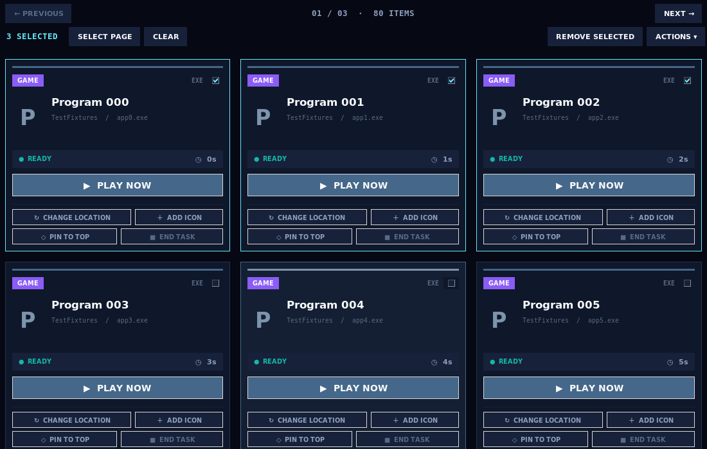
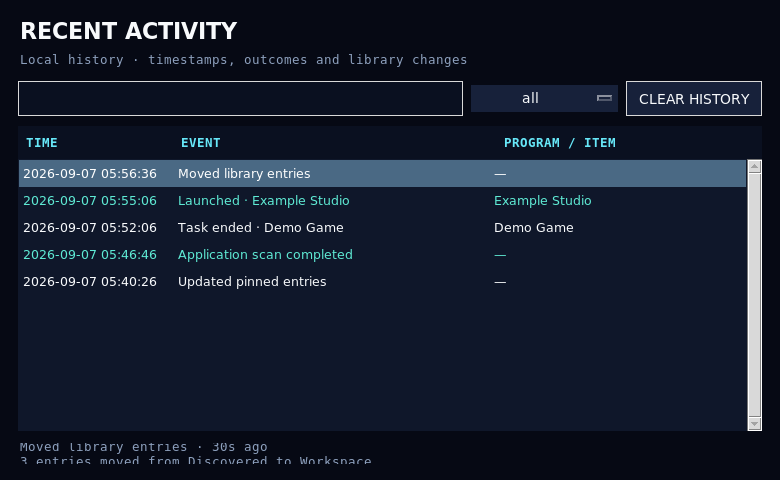

# Library workflow update

## Exactly two scan modes

The whole-system and whole-drive choices have been removed. The scanner now offers:

1. **Control Panel — registered apps:** launchable application entries from the Windows installation registry. It does not additionally walk folders or the Start Menu.
2. **Find programs — usual install locations:** Program Files, the user's Programs folder, Start Menu targets and application locations known from filtered installation records. It does not enumerate and sweep every drive.

Old `quick`, `system` and `all` scope preferences fall back to the safe registered-app mode. The user is not silently opted back into a broad scan.

### Runtime and duplicate filtering

- .NET/ASP.NET/runtime/SDK/targeting-pack entries, Visual C++ redistributables and similar dependencies are not treated as standalone launchable apps.
- Embedded `7z.exe`, `7za.exe`, `7zr.exe` and `7zG.exe` helpers are excluded. An actual 7-Zip GUI installation uses `7zFM.exe`; a bundled copy inside another product is not promoted into Workspace.
- Registry metadata is filtered before expensive executable lookup. Search candidates are deduplicated by product, publisher and installation family, preferring the registered/main executable over internal version copies.
- Different applications under one vendor directory remain separate. Uncertain results still go to Discovered for review.

This is conservative local heuristic discovery, not a perfect inventory or a trained AI service. Existing entries from earlier scans are **not automatically deleted**. Use the new multi-selection tools to remove unwanted launcher entries safely.

## Individual card updates and stable scrolling

Each visible library card has a stable runtime identity. A time/status/selection update changes that card's existing widgets. A structural change such as a new icon, name or trainer rebuilds **only that card**, not the whole page.

The view keeps an item/pixel scroll anchor through structural layout changes. Hover no longer changes card geometry. User scrolling cancels pending automatic anchor restoration. Page changes, searches, tab changes and resizing are intentional navigation/layout operations, not ordinary live updates.

Previous/Next controls appear **both above and below the cards** and use the same page state. Empty and single-page views disable unavailable navigation actions.

## Multi-selection

- Use card checkboxes or **Ctrl-click** on a card's non-button surface.
- **Shift-click** selects a range on the current page.
- **Select Page** selects the visible page; **Clear** clears selection.
- Selection survives live card updates and page changes within a library. The toolbar identifies selections outside the current page. Searches/tab changes reset selection context.
- **Actions** offers moving to Games, Workspace or Discovered, plus pin/unpin.
- **Remove Selected** asks for confirmation and removes entries from the launcher only. It does **not** delete/uninstall executable files or end running processes.

Moves skip conflicts in the destination without deleting the source entry. Batch operations preserve previous in-memory and encrypted-file snapshots on ordinary save failures; the move destination is written before the source. These safeguards do not turn several files into a power-loss-proof database transaction, so retain normal backups.

## End Task result handling

End Task now verifies the actual outcome before reporting failure:

- Already-exited processes, vanished PIDs, zombies and stale `wait_procs` results are treated as finished.
- PID reuse means the original session ended; a different process with the reused PID is not terminated.
- A permission error racing with successful exit is not shown as failure.
- Administrator guidance is shown only when verified remaining processes actually denied access, not appended to every error.
- Genuine surviving children or unverifiable live processes are still reported honestly. This is not permission bypass and does not hide a real failure.

## Recent Activity

Click **Recent Activity / Open History** to open a dedicated history window rather than jumping to system reports.

The history has exact timestamps, relative age/details, search and event-category filters. New events preserve the selected record and browsing position. Header ages update without refreshing the card grid. Identical rapid event bursts are deduplicated; successful library actions and scans add concise outcomes.

**Clear History** affects activity history only, after confirmation. It does not remove libraries, playtime totals, system reports or program files. A failed history save restores the in-memory list. Retired crash events are not reintroduced into the visible history.

## Scope and upgrade

The previous non-blocking launch/exit flow, native icon cache, transparent top-five overlay and data-vault safeguards remain. Crash reporting and the cancelled RAM-cleaner feature remain absent.

Close the launcher and privately back up its application/data folder before upgrading. Replace the complete `xvviix/` code package and the updated root files; keep your vault, libraries, settings, recovery material and icon cache. Run `START_XVVIIX.bat` as before. No new runtime dependency is required.

Linux/Tk tests exercise rendering, selection, persistence failure, scanner policies and termination races. Native Windows/UAC/driver behavior still needs a Windows run. No commit or push was performed in this workspace.

## Validation snapshot — 2026-09-07

- Linux / Python 3.11.16 / Tk 9.0: **223 tests; 215 passed, 8 Windows-only skips**.
- Linux / Python 3.13.14 / Tk 8.6: **223 tests; 215 passed, 8 Windows-only skips**.
- Final runs had no unexpected Tk callback/finalizer errors.
- Compile, pyflakes, dependency consistency, workflow lint and whitespace checks passed.
- Tests verify unchanged card-widget identities during time updates, single-card rebuilds, scroll anchors, mirrored pagers, selection across pages, duplicate-safe transfers, rollback, activity filtering/selection and real child-process termination without a false error.
- Vault cryptography/storage, runtime dependencies and the BAT launcher remain unchanged.
- Native Windows/UAC behavior still requires a Windows run. No commit or push was performed here.
