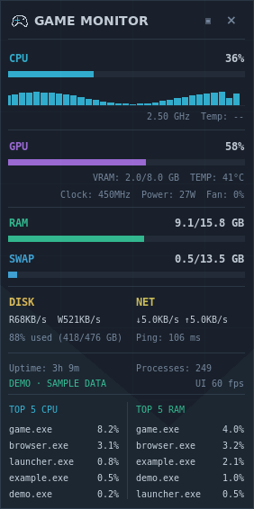
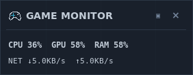

# Monitor simplification and crash-report removal

## Overlay

- Default window opacity is **80%**, so the desktop behind it remains visible.
- Right-click the overlay to choose 60%, 70%, 80%, 90% or 100% opacity. The preference is saved with the other launcher settings; invalid values fall back safely.
- The collapsed panel is **282 × 110** at 1× scale. It shows CPU/GPU/RAM **and live download/upload rates**. Animation remains paused in this mode; readings still update.
- The expanded overlay stays **282 × 566** and shows at most **five CPU leaders and five RAM leaders**, in two compact columns.
- The existing 60 Hz animation target, deadline pacing and scoped Windows timer handling remain in place. This describes the overlay drawing loop, not game FPS.

[Watch the expanded-to-collapsed demo](images/monitor-overlay-demo.mp4). Readings and the backdrop are synthetic demonstration material. The screenshots/video were captured from the actual Tk windows with a compositor, not made by blending a mockup over a background.

Opacity needs compositor support. Windows normally provides that through DWM; a minimal Linux/Xvfb desktop needs a compositor to show the effect. Borderless/windowed games remain the intended overlay use; no game injection or exclusive-fullscreen bypass is added.

## Monitor: top five, not a full process table

The full inventory, process search/sort toolbar, executable-path inspection, thread-count column and process-state column are removed from the Monitor view. It now has two fixed-height panels: **TOP 5 CPU** and **TOP 5 RAM**. Existing hardware, network and system diagnostics remain.

The change is not merely hiding rows:

- Every eligible current-user process is considered approximately every **3 seconds**, so a newly busy process can enter the top five.
- A streaming pair of five-element heaps selects leaders. Application snapshots retain only their union: **at most ten process records**, rather than up to 512 detailed rows.
- Only PID, name, CPU and resident-memory values are retained. Username is checked for the existing current-user filter, but is not copied into each displayed record.
- Executable paths, creation times, thread counts and process state are not queried for this view.
- Local getter reads inside `oneshot()` avoid sharing mutable `process.info` dictionaries with the separate game-session watcher.
- The system-idle pseudo-process is excluded. Percentages remain normalized to 0–100%.

Finding the top five necessarily requires a lightweight periodic pass over eligible processes. The code does **not** claim to discover changing leaders by observing only five fixed PIDs. Process enumeration is independent of the 60 Hz drawing loop.

In one local Linux comparison, median process-sampling time changed from **12.16 ms to 3.10 ms** over 30 calls. That test had only 4–5 eligible current-user processes, so it is not a Windows performance guarantee. Separate synthetic tests verify correct selection across 1,000 candidates, including leaders after the former 512-row cutoff.

## RAM cleaner: not included

The requested memory-cleaner feature was explicitly cancelled. There is no cleanup button, system-wide working-set trimming, standby-cache purge, administrator prompt or automatic memory-cleaning action.

The RAM reading still reports the **whole system's memory usage**, not just launcher memory. The Monitor card is labelled **SYSTEM RAM**. Normal Windows services and other programs can account for several gigabytes shortly after startup; this display is not evidence that the launcher owns that memory.

## Crash Report removed

Removed:

- Automatic game-crash report creation from exit codes.
- Exit-code-to-cause guessing and associated crash/error activity generation.
- The `services/crash_analysis.py` module.
- Crash-specific report filters, cards, counts and copy/export output.

Game launch, process tracking, playtime accounting, explicit End Task and ordinary session-close activity remain. **SYS REPORT** is a separate system-diagnostic feature and remains available.

Old encrypted report records are not erased by an upgrade. Retired records are no longer displayed or generated, and normal system-report creation/deletion preserves them. Clearing reports now explicitly clears **system diagnostics only**, with rollback of in-memory changes if saving fails. Compatibility parsing is retained so an upgrade does not silently destroy old records; it is not an active crash-report feature.

Scanner exclusions such as `crashpad_handler.exe` are still present to stop helper executables being mistaken for games. Those names are unrelated to the removed reporting feature.

## Upgrade

1. Close XVVIIX and privately back up the existing application/data folder.
2. Replace the old **`xvviix/` code folder** with the complete new one, and update the root launcher/docs/tools. This also removes the retired `xvviix/services/crash_analysis.py` file.
3. Keep your `.venv`, libraries, vault metadata, local recovery material, settings and icon cache. User data remains outside the code package in its previous location.
4. Start `START_XVVIIX.bat`. No new runtime dependency is required.

No commit or push was performed in this workspace. Native Windows validation is still separate from Linux tests; the configured Windows CI tests must actually run on Windows.

## Final validation — 2026-09-06

- Python 3.11.16 / Tk 9.0 on Linux: **147 tests, 141 passed, 6 Windows-only skips**.
- Python 3.13.14 / Tk 8.6 on Linux: **147 tests, 141 passed, 6 Windows-only skips**.
- Final runs had no unexpected Tk callback errors. A Tk 9 screen-distance parsing issue found by the new full-Monitor test was fixed without forcing synchronous layout updates.
- Compilation, pyflakes, dependency consistency and whitespace checks passed.
- Vault cryptography/storage, runtime dependencies and the BAT launcher are unchanged.
- Native Windows DPAPI, multimedia-timer and BAT checks were not executed in this Linux workspace. Windows/game-load performance is not certified by these local tests.

The latest synthetic overlay run remained approximately **60 drawing callbacks per second**. Machine-readable measurements and sampling comparison: [monitor-results.json](monitor-results.json). This is not a game-FPS claim.
