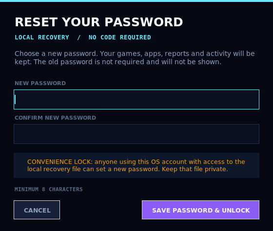

# Forgot Password — local, code-free reset

Implementation now lives in `xvviix/storage/vault.py`, `xvviix/security/crypto.py` and `xvviix/ui/vault_dialogs.py`. The user flow and encrypted formats are unchanged; see [architecture](architecture.md).

XVVIIX can reset the master password **without the old password, an email account, a server, or a recovery code** when local password reset has already been enabled on this computer. Games, apps, discovered entries, reports, playtime and activity are preserved.



*Actual Tk dialog captured with a Linux virtual display; native Windows decoration may differ.*

## What the user sees

### New vault

1. Enter and confirm a master password.
2. Review **Enable local password reset on this computer**. It is checked by default, with an explanation of the reduced protection. Uncheck it to retain password-only protection.
3. Choose **CREATE VAULT**.

### Existing vault

Existing vaults are not silently weakened or migrated.

1. Enter the current master password on the unlock screen.
2. Check **Enable local password reset on this computer**. For existing vaults, this starts unchecked.
3. Choose **UNLOCK XVVIIX**. After successful password verification, local recovery is activated without rewriting the existing library ciphertext.

An already-forgotten password for an older vault cannot be bypassed retroactively. The previous version did not store the extra recovery material needed to decrypt that data.

### Forgotten password

1. Choose **FORGOT PASSWORD?** on the unlock screen.
2. Enter the new password twice (8–1024 characters).
3. Choose **SAVE PASSWORD & UNLOCK**.

There is no code to find or enter. The old password is not displayed. The current primary and backup vault metadata are updated to use the new password, and the launcher opens the existing libraries. The reset work runs outside the Tk thread; duplicate submission and closing the dialog during the operation are prevented. **CANCEL** before submission changes nothing.

## Security model — read before enabling

This mode is a **convenience lock**, not a password-only security boundary.

- Someone who can use the same operating-system account and access its local recovery material can reset the password and read the vault. This is intentional for a non-sensitive, local launcher.
- Data files remain AES-256-GCM encrypted. The old/new plaintext password is not saved.
- `xvviix_local_recovery.json` holds data-key recovery material and must be treated as a secret. Never upload it, commit it, or include it in public bug reports.
- On **Windows**, the recovery key is protected with current-user **DPAPI**, with vault-specific entropy and no machine-wide flag. Failure to use DPAPI does **not** fall back to storing a raw key.
- On **Linux/non-Windows development systems**, the recovery file contains a base64-encoded data key protected by private file permissions (`0600`), **not by password encryption**. It is rejected if group/other permissions are present. Anyone who can read this file can recover the data.
- This is not protection against malware, administrators, or another person controlling the same OS account. Password-only mode also cannot protect decrypted data from malware while the launcher is unlocked.

Keep a secure backup of the encrypted data and matching vault metadata. Historical copies of old metadata cannot be revoked by an offline password change: the data key stays stable, so an old password plus an old metadata copy may still decrypt matching data. The normal current `.bak` is replaced with metadata for the new password during reset.

## Missing files, another computer, or corruption

- **Local recovery file missing/damaged:** sign in with the current password and check the local-reset option to recreate it. Alternatively, restore your own matching recovery-file backup.
- **Different OS or Windows account/profile:** a copied recovery file may not be usable. Sign in using the master password and enable local reset on the new computer/account. Do not assume DPAPI recovery is portable.
- **Neither password nor usable local recovery material:** encrypted data cannot be recovered by this feature. XVVIIX explains the limitation; it does not delete, archive or replace the user's vault with an empty one.
- **Unmatched recovery file or invalid key:** reset is refused before password settings change.
- **Damaged current data:** reset refuses to commit and does not substitute an empty library. If a matching backup can be verified, the error explains the manual recovery route.
- **Damaged backup/archive with healthy current data:** reset now continues with a warning and keeps the artifact untouched. Before a later normal save rotates a damaged `.bak`, its exact bytes are preserved in a private `.corrupt-backup-*` archive. See [stability and recovery rules](stability.md).
- **Existing recovery file but missing vault metadata:** setup refuses to overwrite that recovery file. Restore the matching metadata first.

## Implementation and compatibility

- Password-only `xvviix-vault-v1` metadata is still supported.
- Recoverable vaults use `xvviix-vault-v2` metadata. A stable data key is wrapped by a password-derived key (scrypt + AES-256-GCM). A separate local recovery record can retrieve the same data key.
- Legacy opt-in preserves the original data key; reset changes only its password wrapping. Existing encrypted data files and their backups remain byte-for-byte unchanged during successful opt-in/reset.
- Key wrapping, encrypted data and local recovery use separate cryptographic contexts. Recovery material is bound to a vault identifier and checked before use.
- Password-setting updates write backup metadata before primary metadata and attempt rollback on ordinary I/O failures. Interruption does not require re-encrypting the library because its data key is unchanged. If the application is interrupted during a reset, retry local reset; a partially completed legacy activation may still require the existing password.
- Applications predating v2 metadata cannot open a migrated/recoverable vault. Keep a private pre-upgrade backup if downgrading is a requirement.
- No new third-party runtime dependency or network service is added.

## Tests

Run from the repository root, inside the project's Python environment:

```sh
python -m compileall -q game_launcher.py xvviix tests
python -m pyflakes game_launcher.py xvviix tests
python -m unittest discover -s tests -v
```

The tests use disposable vaults and a temporary copy of the launcher. They never load your real libraries or passwords. They cover legacy compatibility, explicit activation, repeat resets, unchanged data, old-password rejection, malformed/missing/mismatched recovery, permissions, failure rollback and Tk dialog behavior.

Tk tests skip when no display is available. On Linux, a virtual display can be used:

```sh
xvfb-run -a -s '-screen 0 1280x900x24 -nolisten tcp' python -m unittest discover -s tests -v
```

The real DPAPI integration test runs only on Windows. A successful Linux run does not certify native Windows behavior; Windows validation is still required before release.

Full-launcher testing also exposed an existing shutdown error when music was disabled and pygame had never been imported. Two `pygame is not None` guards and a focused audio-standby regression test are included so that completing a reset and later closing the launcher does not fail in that state. No other audio behavior is changed.
