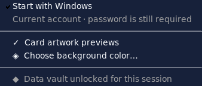

# Start with Windows

## Behavior

After the first successful Windows launch/unlock, XVVIIX registers itself to start at the **next sign-in to the current Windows account**. This is user-login startup, not a machine-wide service or a pre-login boot task.

Open **Settings → Start with Windows** inside the launcher to disable or enable it. Disabling removes only the launcher’s own Run value. A separate per-user marker remembers that a choice has been made, so the program does **not** automatically enable itself again on the next launch. Removing an already initialized entry externally is also respected.



The image is an actual Tk settings-menu capture using a mock registry for demonstration. This Linux workspace did not modify the user's Windows registry.

## Registry ownership

Only these application-owned values are managed:

```text
HKEY_CURRENT_USER\Software\Microsoft\Windows\CurrentVersion\Run
    XVVIIXLauncher = <quoted launch command>  (REG_SZ)

HKEY_CURRENT_USER\Software\XVVIIXLauncher\Preferences
    StartupChoiceMade = 1  (REG_DWORD)
```

No administrator prompt, HKLM change, scheduled task or Windows service is created. Other applications’ startup values are not deleted or changed. The preference key is retained when disabling to preserve the opt-out.

A pre-existing XVVIIX entry is adopted rather than silently overwritten. If it points to another folder, Settings offers **Use this copy at Windows startup** as an explicit action.

## Launch command and data safety

- Source installs use the currently running Python environment, preferring its sibling `pythonw.exe` to avoid a console window.
- The entry-point path is absolute and quoted. The `.venv` interpreter is not replaced by an unrelated global Python.
- Frozen builds are handled using the actual launcher executable. No `.exe` was built in this workspace.
- `--autostart` identifies the startup command; it does not bypass normal application initialization or vault authentication.
- Passwords, recovery material and library data are not stored in the registry.
- The command is validated rather than silently truncated. If the project path makes it too long for a Run entry, move the project to a shorter permanent location and enable startup again.

Keep the project in a permanent folder. Before moving or deleting that folder, disable startup; after moving it, enable it again or use the explicit path-update action. Keep the complete `xvviix/` package and assets beside `game_launcher.py`.

## Windows controls and failure cases

The checkbox reports whether the application's Run registration exists. Windows **Settings → Apps → Startup**, Task Manager's Startup Apps controls, or organizational policy can independently block startup. XVVIIX does not override Windows' StartupApproved records or administrative policy. If registration is enabled but the app does not launch, check those Windows controls as well.

Registry read/write failures are reported instead of pretending the change succeeded. A failed disable leaves the checkbox reflecting the actual registration. Failure to save the initial choice attempts to restore the previous Run value.

On non-Windows systems the option is clearly disabled, and no registry operation occurs. Merely importing the backend or the Python entry point does not register startup. The default registration is scheduled only after the desktop has initialized and the vault has been unlocked successfully.

## Validation

Tests cover current-user ownership, unrelated-value preservation, enable/disable, persistent opt-out, external removal, pre-existing entries, write failures/rollback, absolute path quoting, matching `pythonw`, frozen command construction and the Settings checkbox.

Application UI tests explicitly disable the real startup integration, including on Windows CI runners. A Windows-only native registry test uses a unique private test key, **not the real login Run key**, and cleans it up afterwards. Actual launch at Windows sign-in still requires a Windows machine and a sign-out/sign-in test.

No commit or push was performed during this phase.

### Local validation snapshot — 2026-09-07

- Python 3.11.16 / Tk 9.0 on Linux: **246 tests; 237 passed, 9 Windows-only skips**.
- Python 3.13.14 / Tk 8.6 on Linux: **246 tests; 237 passed, 9 Windows-only skips**.
- Final runs had no unexpected Tk callback/finalizer errors.
- Compilation, pyflakes, dependency consistency and whitespace checks passed.
- Native Windows registry/login execution was not performed in this workspace. The added native test is confined to a disposable private HKCU test key when run on Windows.
